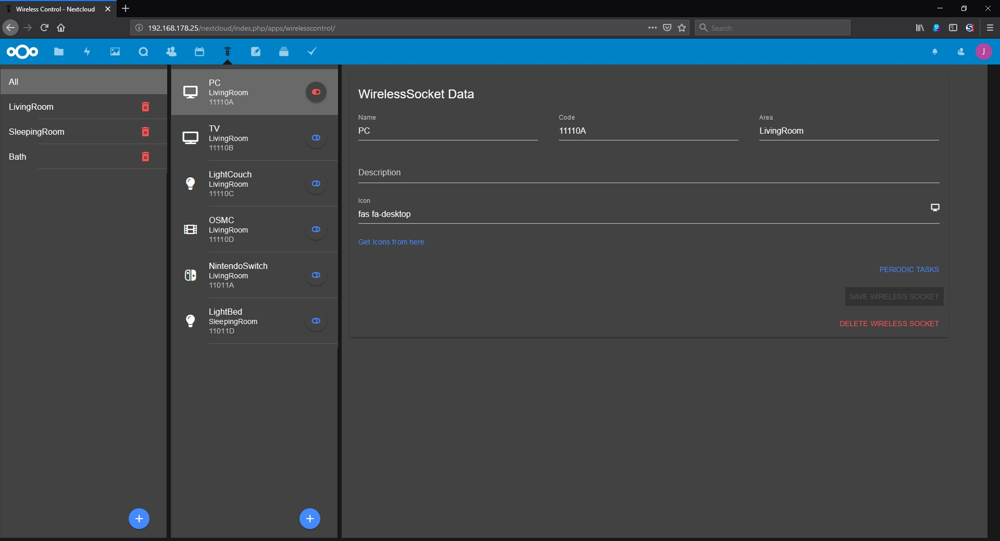
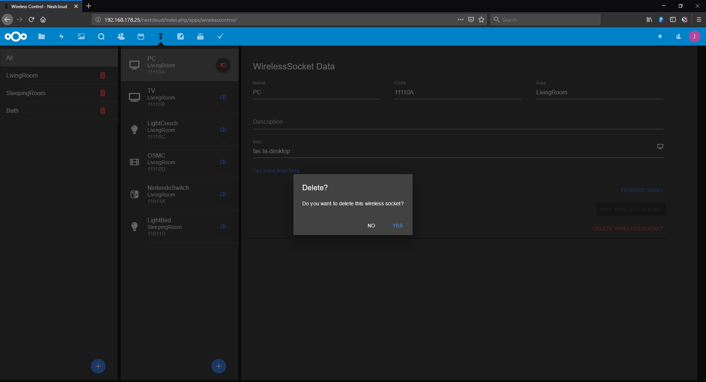

# WirelessControl

* set states for 433MHz connected sockets




Place this app in **nextcloud/apps/**

## Building the app

The app can be built by using the provided Makefile by running:

    make

This requires the following things to be present:
* make
* which
* tar: for building the archive
* curl: used if phpunit and composer are not installed to fetch them from the web
* npm: for building and testing everything JS, only required if a package.json is placed inside the **js/** folder

The make command will install or update Composer dependencies if a composer.json is present and also **npm run build** if a package.json is present in the **js/** folder. The npm **build** script should use local paths for build systems and package managers, so people that simply want to build the app won't need to install npm libraries globally, e.g.:

**package.json**:
```json
"scripts": {
	"serve": "vue-cli-service serve",
	"build_vue": "vue-cli-service build",
	"dev": "webpack --config webpack.dev.js",
	"watch": "webpack --progress --watch --config webpack.dev.js",
	"build": "webpack --progress --hide-modules --config webpack.prod.js",
	"lint": "eslint --ext .js,.vue src",
	"lint:fix": "eslint --ext .js,.vue src --fix",
	"stylelint": "stylelint src",
	"stylelint:fix": "stylelint src --fix",
	"test": "mocha-webpack --webpack-config webpack.test.js --interactive false --require tests/setup.js \"tests/js/**/*.spec.js\"",
	"test:watch": "mocha-webpack -w --webpack-config webpack.test.js --interactive false --require tests/setup.js \"tests/js/**/*.spec.js\""
}
```


## Publish to App Store

First get an account for the [App Store](http://apps.nextcloud.com/) then run:

    make && make appstore

The archive is located in build/artifacts/appstore and can then be uploaded to the App Store.

## Running tests

You can use the provided Makefile to run all tests by using:

    make test

This will run the PHP unit and integration tests and if a package.json is present in the **js/** folder will execute **npm run test**

Of course you can also install [PHPUnit](http://phpunit.de/getting-started.html) and use the configurations directly:

    phpunit -c phpunit.xml

or:

    phpunit -c phpunit.integration.xml

for integration tests
